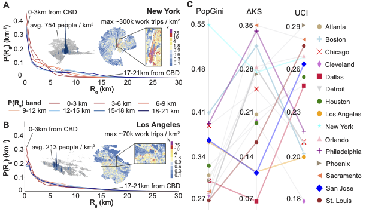

# Hybrid Work and the Restructuring of Urban Mobility in U.S. Cities

This repository contains data and code to reproduce main figures in the paper. Some raw data cannot be shared due to use agreements. Scripts for calculating spatial structure metrics can be found under `/src`.

## Overview
Understanding mobility patterns and how they generalize or vary across cities provides a direct lens into system-level post-pandemic urban dynamics. To advance this understanding, we analyze population-scale mobile device data spanning 2019–2024 across 15 major U.S. metropolitan areas. To assess whether mobility changes are moderated by urban forms, we synthesize three behavior-grounded spatial structure metrics: compactness (population density), mobility centrality (downtown effect), and job concentration (work-trip attractor).   

## Requirements
- Python 3.11 with `rtree` 1.4.1, `pyproj` 3.7.2, `fiona` 1.10.1, `gdal` 3.10.3, `pillow` 11.3.0
- R 4.5.1 with `uci` 0.3.0, `cppRouting` 3.1, `spdep` 1.3-13, and `tigris` 2.2.1

See `environment.yml` and `renv.lock` for complete dependencies.